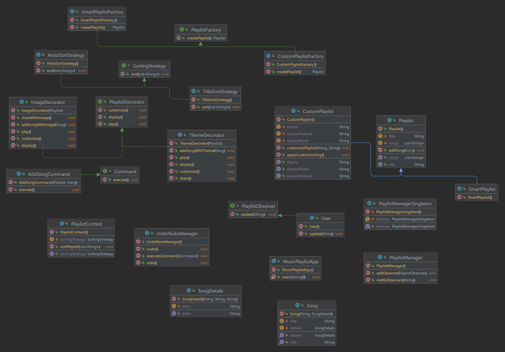

# SDP_Final
  
 
 

 
Music Playlist Management System

“Software Design Patterns” course
 

 
Group: SE-2224

Team members: Nurgaziz Serik

Teaching Assistant: Arailym Bakenova 

 
Astana, 2023

## Project Overview
### Information about the Project:
 The project is a music playlist application designed to manage and customize playlists with various features.   
Developed using Java, the application employs multiple design patterns to enhance modularity, flexibility, and maintainability.   

### Idea of the Project:
The idea is to create a robust music playlist application that allows users to customize playlists, apply themes, and utilize various design patterns to achieve a scalable and extensible architecture.  

### Purpose of the Work:
The purpose is to showcase the practical implementation of different design patterns in a real-world software application.  
Demonstrate how these patterns contribute to code organization, reusability, and scalability.  

### Objectives of the Work:
Implement features like adding songs, customizing playlists, applying themes, and sorting strategies.  
Utilize design patterns such as Command, Decorator, Factory, Observer, Singleton, and Strategy.  
Create a modular and extensible codebase for easy maintenance and future enhancements.  

## UML Diagram
 

https://github.com/snk137/SDP_Final

## Main body
### Features and Design Patterns:
### Observer Pattern:  
Used in the «PlaylistManager» to notify users (observers) about changes in the playlist, e.g., when a new song is added.  

### Singleton Pattern:  
Applied in «PlaylistManagerSingleton» to ensure a single instance of the playlist manager is created.  

### Command Pattern:  
Implemented through the «AddSongCommand» class, allowing for the execution and undoing of adding songs to the playlist.  

### Decorator Pattern:  
«ImageDecorator» and «ThemeDecorator» extend the functionality of a playlist by adding image and theme customization features.  

### Factory Pattern:  
«CustomPlaylistFactory» and «SmartPlaylistFactory» create instances of custom and smart playlists, respectively.  

### Strategy Pattern:  
«SortingStrategy» interface and its implementations («TitleSortStrategy» and «ArtistSortStrategy») enable dynamic sorting strategies in the «PlaylistContext».  

## Conclusion 
### Key Points:  
The project successfully demonstrates the integration of multiple design patterns for a music playlist application.  
Notable patterns include Observer for notifications, Singleton for a single playlist manager instance, Command for undo/redo functionality, Decorator for customization, Factory for playlist creation, and Strategy for dynamic sorting.  

### Project Outcomes:
Successfully implemented a modular and extensible music playlist application.  
Challenges included coordinating interactions between various design patterns and ensuring seamless integration.  

### Future Improvements:
Enhance the user interface for a more interactive experience.  
Implement additional customization options and playlist management features.  
Explore integration with external APIs for song recommendations.  

In conclusion, the project achieved its objectives by effectively utilizing various design patterns, resulting in a well-organized and extensible music playlist application. Future improvements can further enhance the application's functionality and user experience.  

